<div align="center">

# SPK SAW-KMKK Realtime

### Sistem Pendukung Keputusan Pemilihan Vendor Alat Kesehatan Rumah Sakit

Metode Hibrid SAW-KMKK dan K-Nearest Neighbors Berbasis Big Data Analytics Pengadaan Realtime (OCDS)

_Hybrid Model-Driven + Data-Driven Decision Support System_


</div>

\---

## Daftar Isi

1. [Ringkasan](#ringkasan)
2. [Fitur Utama](#fitur-utama)
3. [Konsep dan Metodologi](#konsep-dan-metodologi)
4. [Alur Penelitian](#alur-penelitian)
5. [Arsitektur Sistem](#arsitektur-sistem)
6. [Alur Data (Pipeline)](#alur-data-pipeline)
7. [Teknologi](#teknologi)
8. [Struktur Proyek](#struktur-proyek)
9. [Persyaratan](#persyaratan)
10. [Instalasi](#instalasi)
11. [Konfigurasi](#konfigurasi)
12. [Cara Penggunaan](#cara-penggunaan)
13. [Tampilan Aplikasi](#tampilan-aplikasi)
14. [Skema Basis Data](#skema-basis-data)
15. [Kriteria dan Skala Penilaian](#kriteria-dan-skala-penilaian)
16. [Detail Algoritma](#detail-algoritma)
17. [Mengembangkan ke Studi Kasus Lain](#mengembangkan-ke-studi-kasus-lain)
18. [Troubleshooting](#troubleshooting)
19. [Keterbatasan dan Rencana Pengembangan](#keterbatasan-dan-rencana-pengembangan)
20. [Lisensi Data dan Atribusi](#lisensi-data-dan-atribusi)
21. [Kredit](#kredit)

\---

## Ringkasan

SPK SAW-KMKK Realtime adalah aplikasi web pendukung keputusan untuk memeringkat dan memilih vendor alat kesehatan rumah sakit secara objektif dan transparan. Sistem ini menggabungkan dua pendekatan:

- **Model-Driven**, yaitu penilaian terstruktur menggunakan metode hibrid SAW (Simple Additive Weighting) dan KMKK (Kuantifikasi Multi-Kriteria Kualitatif, metode linguistik Yager 1993).
- **Data-Driven**, yaitu data penilaian tidak diinput manual, melainkan ditarik secara realtime dari big data pengadaan publik berstandar OCDS (Open Contracting Data Standard), kemudian divalidasi menggunakan K-Nearest Neighbors (KNN).

Gagasan utamanya: alih-alih meminta pakar mengisi nilai setiap vendor secara manual, sistem menurunkan kriteria penilaian langsung dari data transaksi pengadaan nyata. Dengan demikian keputusan menjadi objektif, dapat diaudit, dan terbarukan secara otomatis.

\---

## Fitur Utama

| Fitur                  | Deskripsi                                                                                 |
| ---------------------- | ----------------------------------------------------------------------------------------- |
| Dashboard realtime     | Ringkasan jumlah rilis OCDS, baris kontrak, vendor agregat, dan kandidat SPK.             |
| Sinkronisasi data      | Menarik data live dari API OCDS, atau menggunakan snapshot lokal (mode offline).          |
| Data master            | Pengelolaan kriteria, skala, pakar, dan alternatif vendor.                                |
| Penilaian              | Matriks penilaian linguistik yang diturunkan otomatis dari data dan dapat ditinjau pakar. |
| Perhitungan transparan | Menampilkan langkah SAW, KMKK (Minimax), dan OWA secara rinci.                            |
| Analytics              | Tren volume kontrak per tahun, distribusi nilai, dan statistik vendor.                    |
| Data-Driven (KNN)      | Klasifikasi vendor (Unggulan, Layak, Berisiko) beserta validasi LOO-CV.                   |
| Snapshot offline       | Sistem tetap berjalan tanpa internet menggunakan cadangan data lokal.                     |

\---

## Konsep dan Metodologi

Sistem bertumpu pada empat dasar teori berikut.

| Metode            | Peran                                                                                        | Sumber                       |
| ----------------- | -------------------------------------------------------------------------------------------- | ---------------------------- |
| SAW               | Normalisasi nilai kriteria (benefit/cost) menjadi rasio, lalu dipetakan ke skala linguistik. | MADM klasik                  |
| KMKK              | Agregasi kualitatif linguistik 7 tingkat: Minimax (per pakar) dan OWA (kelompok).            | Yager (1993)                 |
| KNN               | Validasi data-driven: klasifikasi kelas vendor dari k tetangga terdekat.                     | Cover dan Hart (1967)        |
| OCDS dan Big Data | Sumber data pengadaan terbuka, realtime, dan semi-terstruktur (JSON).                        | Open Contracting Partnership |

### Mengapa KNN, bukan Random Forest atau SVM

- KNN berperan sebagai validator sederhana, bukan model produksi berskala besar.
- Jumlah kandidat kecil (sekitar 10 vendor), sehingga algoritma kompleks rawan overfitting dan membutuhkan penyetelan parameter.
- KNN mudah dijelaskan: sebuah vendor diklasifikasikan ke suatu kelas karena kemiripannya dengan tetangga terdekat.
- KNN tidak memerlukan fase pelatihan, sehingga ringan dan cocok dihitung ulang secara realtime.

### Mengapa tetap disebut Big Data meskipun hasil akhirnya sedikit

Istilah big data mengacu pada karakteristik sumber dan prosesnya, bukan pada jumlah baris akhir yang ditampilkan.

- Volume: sumber OCDS memuat ribuan hingga jutaan rilis yang terus bertambah.
- Velocity: data ditarik secara realtime melalui API pada setiap sinkronisasi.
- Variety: data berbentuk JSON OCDS yang semi-terstruktur dan bersarang.
- Value dan Veracity: data diolah melalui proses ETL (pembersihan, transformasi, agregasi).

Data yang tampak sedikit hanyalah hasil ekstraksi setelah penyaringan (CPV 33, rentang tahun, dan `top\_n`).

\---

## Alur Penelitian

Diagram berikut menggambarkan tahapan penelitian secara menyeluruh, mulai dari identifikasi masalah hingga penarikan kesimpulan.

<details>
  <summary>Diagram Alur Penelitian</summary>
  <p align="center">
    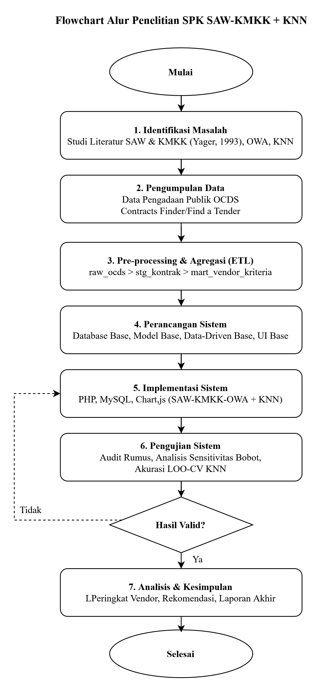
  </p>
</details>

Secara ringkas, tahapannya adalah:

1. Identifikasi masalah dan studi pustaka.
2. Penentuan kriteria (C1 sampai C3) dan bobot.
3. Pengumpulan big data OCDS secara realtime.
4. Transformasi dan agregasi data per vendor.
5. Perhitungan SAW, KMKK, dan OWA.
6. Validasi KNN dan penarikan kesimpulan.

\---

## Arsitektur Sistem

Sistem disusun berlapis (layered) untuk memisahkan presentasi, logika metode, pengolahan data, dan sumber data eksternal.

<details>
  <summary>Diagram Arsitektur Sistem</summary>
  <p align="center">
    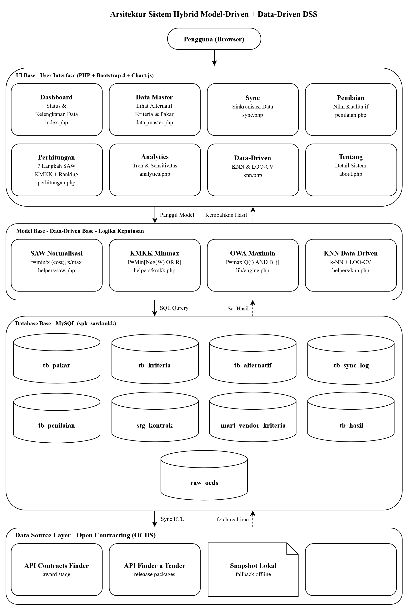
  </p>
</details>

Penjelasan tiap lapisan:

- **Lapisan Presentasi**: antarmuka pengguna (Dashboard, Sync, Penilaian, Perhitungan, Analytics, KNN).
- **Lapisan Model**: mesin perhitungan SAW, KMKK (Minimax), OWA, dan KNN beserta validasi LOO-CV.
- **Lapisan Data**: tahapan penyimpanan dari `raw\_ocds` ke `stg\_kontrak`, `mart\_vendor\_kriteria`, dan `tb\_hasil`.
- **Sumber Data**: API OCDS (Contracts Finder dan Find a Tender) dengan opsi snapshot lokal sebagai cadangan offline.

\---

## Alur Data (Pipeline)

Pengolahan data berjalan berurutan dari pengambilan data mentah hingga peringkat akhir.

| Tahap         | File                                                  | Output                                        |
| ------------- | ----------------------------------------------------- | --------------------------------------------- |
| 1. Fetch      | `ingestion/fetch\_ocds.php`                           | Data mentah ke `raw\_ocds`                    |
| 2. Transform  | `ingestion/transform.php`                             | Kontrak bersih ke `stg\_kontrak`              |
| 3. Aggregate  | `ingestion/aggregate.php`                             | Metrik per vendor ke `mart\_vendor\_kriteria` |
| 4. Engine     | `lib/engine.php`                                      | Skor dan peringkat ke `tb\_hasil`             |
| 5. Orkestrasi | `ingestion/sync\_all.php`, `ingestion/cron\_sync.php` | Menjalankan seluruh pipeline                  |

Urutan ringkas: Fetch, lalu Transform, lalu Aggregate, lalu Engine (SAW + KMKK + OWA), dan terakhir penyusunan hasil beserta validasi KNN.

\---

## Teknologi

- Bahasa: PHP 7.4 ke atas (disarankan 8.x), tanpa framework.
- Basis data: MySQL atau MariaDB 10.4 ke atas.
- Frontend: HTML, CSS kustom, dan Chart.js untuk visualisasi.
- Sumber data: API OCDS, yaitu Contracts Finder dan Find a Tender (GOV.UK).
- Server lokal: XAMPP atau Laragon (disarankan).

\---

## Struktur Proyek

```text
spk-sawkmkk-realtime/
├── config/
│   ├── config.php           # Konfigurasi global (DB, parameter metode, OCDS)
│   └── koneksi.php          # Koneksi PDO
├── helpers/
│   ├── skala.php            # Skala linguistik S1..S7 dan operasi negasi
│   ├── saw.php              # Normalisasi SAW (cost/benefit) dan pemetaan skala
│   ├── kmkk.php             # Minimax (individu), OWA, dan fungsi kuantor Q
│   ├── entropy.php          # Bobot objektif opsional (metode Entropy)
│   └── knn.php              # KNN: jarak, prediksi, kelas, validasi LOO-CV
├── lib/
│   └── engine.php           # Orkestrasi perhitungan SAW-KMKK-OWA ke tb\_hasil
├── ingestion/
│   ├── fetch\_ocds.php      # Pengambilan data OCDS (live atau snapshot)
│   ├── transform.php        # ETL: raw ke stg\_kontrak
│   ├── aggregate.php        # Agregasi vendor ke mart\_vendor\_kriteria
│   ├── sync\_all.php        # Pipeline lengkap (dipakai antarmuka)
│   └── cron\_sync.php       # Runner CLI untuk sinkronisasi tanpa batas waktu web
├── database/
│   └── spk\_sawkmkk\_rt.sql # Skema dan data master awal
├── data/
│   └── snapshot\_ocds.json  # Cadangan data offline (fallback)
├── templates/
│   ├── header.php           # Navigasi dan bagian head
│   └── footer.php
├── assets/css/style.css
├── images/                  # Dokumentasi
│   ├── alur-penelitian.png
│   ├── arsitektur-sistem.png
│   ├── erd.png
│   ├── dashboard.png
│   ├── data-master.png
│   ├── sync.png
│   ├── penilaian.png
│   ├── perhitungan.png
│   ├── analytics.png
│   ├── knn.png
│   └── tentang.png
├── install.php              # Installer otomatis (membuat DB dan data master)
├── index.php                # Dashboard
├── data\_master.php         # Data master (kriteria, skala, pakar, alternatif)
├── sync.php                 # Halaman sinkronisasi data
├── penilaian.php            # Matriks penilaian
├── perhitungan.php          # Rincian perhitungan SAW-KMKK-OWA
├── analytics.php            # Statistik dan grafik
├── knn.php                  # Modul data-driven (KNN dan LOO-CV)
├── about.php                # Tentang sistem
├── LICENSE-DATA.txt         # Lisensi dan atribusi data OCDS
└── LICENSE                  # MIT
└── README.md
```

## Persyaratan

- PHP 7.4 ke atas dengan ekstensi PDO, pdo_mysql, curl, dan json.
- MySQL atau MariaDB.
- Koneksi internet untuk mode live (opsional bila menggunakan snapshot).
- Browser modern.

\---

## Instalasi

### A. Menggunakan Laragon (disarankan)

1. Salin proyek ke folder web root:

```text
   C:\\laragon\\www\\spk-sawkmkk-realtime
```

2. Jalankan Laragon, lalu Start All (Apache dan MySQL).
3. Sesuaikan kredensial basis data pada `config/config.php` bila perlu. Default Laragon menggunakan user `root` dengan password kosong.
4. Buka installer pada browser:

```text
   http://localhost/spk-sawkmkk-realtime/install.php
```

Installer akan membuat basis data `spk\_sawkmkk\_rt`, membuat seluruh tabel, dan mengisi data master (skala, kriteria, pakar).

5. Buka aplikasi:

```text
   http://localhost/spk-sawkmkk-realtime/
```

### B. Menggunakan XAMPP

1. Salin proyek ke `C:\\xampp\\htdocs\\spk-sawkmkk-realtime`.
2. Jalankan Apache dan MySQL dari XAMPP Control Panel.
3. Opsional: impor `database/spk\_sawkmkk\_rt.sql` melalui phpMyAdmin, atau cukup jalankan `install.php`.
4. Buka `http://localhost/spk-sawkmkk-realtime/install.php`, kemudian akses aplikasi.

### C. Tanpa Internet (mode offline)

Setel `use\_fallback => true` pada konfigurasi (nilai default). Sistem akan memuat `data/snapshot\_ocds.json` secara otomatis ketika API tidak dapat dihubungi, sehingga aplikasi tetap dapat dijalankan untuk demonstrasi.

\---

## Konfigurasi

Seluruh parameter berada pada `config/config.php`.

| Kunci                 | Default                              | Keterangan                                                                          |
| --------------------- | ------------------------------------ | ----------------------------------------------------------------------------------- |
| `db.\*`               | `127.0.0.1 / root / (kosong)`        | Kredensial basis data                                                               |
| `q`                   | `7`                                  | Jumlah tingkat skala linguistik (S1..S7)                                            |
| `top\_n`              | `10`                                 | Jumlah vendor kandidat teratas berdasarkan frekuensi award. Nilai `0` berarti semua |
| `currency`            | `GBP`                                | Mata uang sumber data (pengadaan UK)                                                |
| `bobot`               | `C1=7, C2=6, C3=5`                   | Bobot kriteria (skala S=7, SB=6, B=5)                                               |
| `ocds.sources`        | `\[contracts-finder, find-a-tender]` | Urutan sumber API yang dicoba                                                       |
| `ocds.years\_back`    | `5`                                  | Jendela data (jumlah tahun terakhir)                                                |
| `ocds.cpv\_prefixes`  | `\['33']`                            | Filter kategori CPV (33 untuk alat medis)                                           |
| `ocds.max\_pages`     | `80`                                 | Batas jumlah halaman per sinkronisasi                                               |
| `ocds.max\_seconds`   | `90`                                 | Anggaran waktu fetch live (detik)                                                   |
| `ocds.target\_health` | `1500`                               | Berhenti setelah mengumpulkan sejumlah rilis                                        |
| `ocds.timeout`        | `20`                                 | Timeout cURL per permintaan                                                         |
| `ocds.use\_fallback`  | `true`                               | Menggunakan snapshot lokal bila API gagal                                           |

Untuk menarik data dalam jumlah besar tanpa terkena batas waktu PHP web (misalnya pesan Maximum execution time exceeded), jalankan sinkronisasi melalui CLI: `php ingestion/cron\_sync.php`. PHP pada mode CLI mengabaikan `max\_execution\_time`.

\---

## Cara Penggunaan

1. Sinkronisasi data melalui menu Sync, dengan dua mode:
   - Live (`use\_fallback=false`): menarik data nyata dari API OCDS.
   - Snapshot: menggunakan cadangan lokal untuk keperluan offline atau demonstrasi.

2. Meninjau data melalui menu Data untuk melihat kriteria, skala, pakar, dan vendor kandidat.
3. Melihat penilaian melalui menu Penilaian berupa matriks nilai linguistik tiap vendor.
4. Menelusuri perhitungan melalui menu Perhitungan: langkah SAW, Minimax, OWA, hingga peringkat akhir.
5. Melihat analitik melalui menu Analytics berupa tren dan distribusi data.
6. Melakukan validasi melalui menu Data-Driven (KNN): kelas vendor dan akurasi LOO-CV.

Setiap kali konfigurasi diubah (misalnya `top\_n`), jalankan sinkronisasi ulang atau gunakan opsi putar ulang snapshot agar `tb\_hasil` dihitung kembali. Sekadar memuat ulang halaman tidak mengubah hasil, karena hasil sudah dihitung pada saat sinkronisasi.

\---

## Tampilan Aplikasi

Bagian ini menampilkan tangkapan layar setiap halaman, dari Dashboard hingga Tentang.

### Dashboard

Menampilkan ringkasan jumlah rilis OCDS, baris kontrak, vendor agregat, dan kandidat SPK beserta status data.

  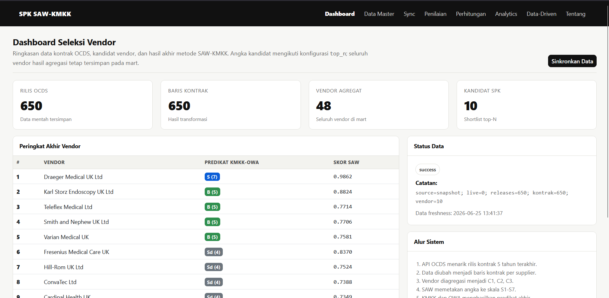

### Data Master

Menampilkan pengelolaan kriteria, skala, pakar, dan alternatif vendor.

  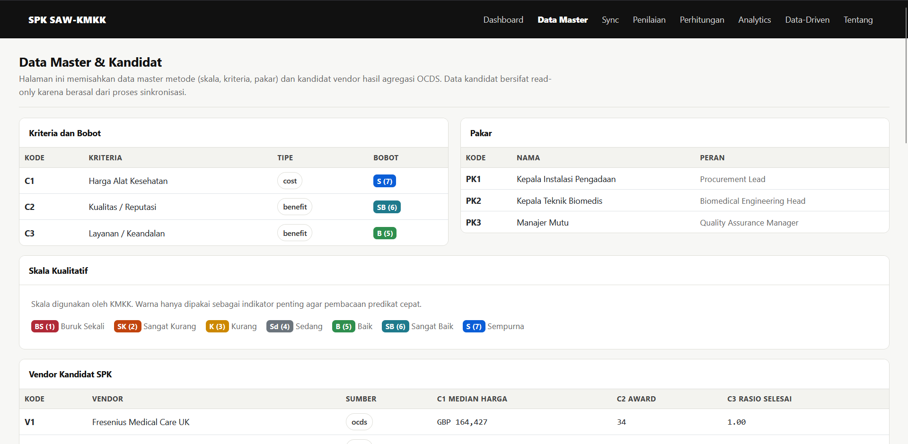

### Sync

Menampilkan proses sinkronisasi data, pilihan mode live atau snapshot, dan riwayat sinkronisasi.

  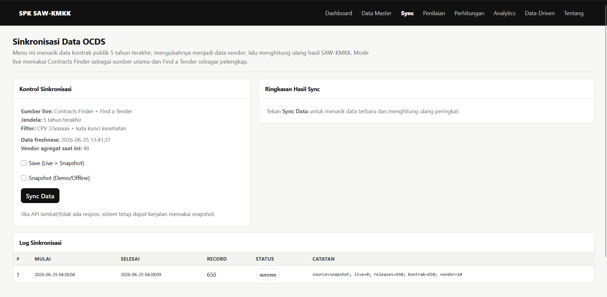

### Penilaian

Menampilkan matriks penilaian linguistik tiap vendor terhadap setiap kriteria.

  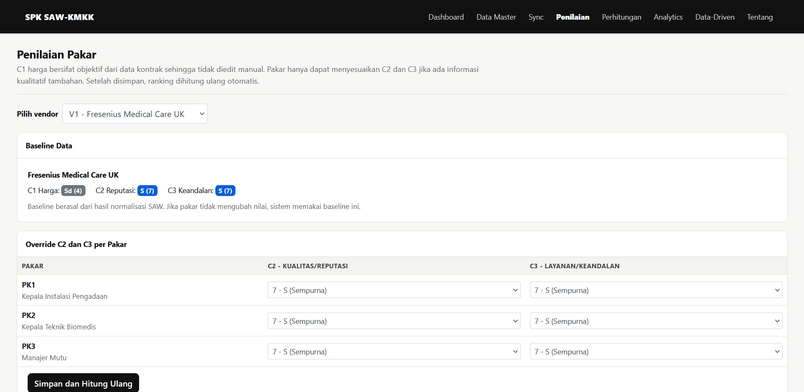

### Perhitungan

Menampilkan rincian langkah perhitungan SAW, KMKK (Minimax), dan OWA hingga peringkat akhir.

  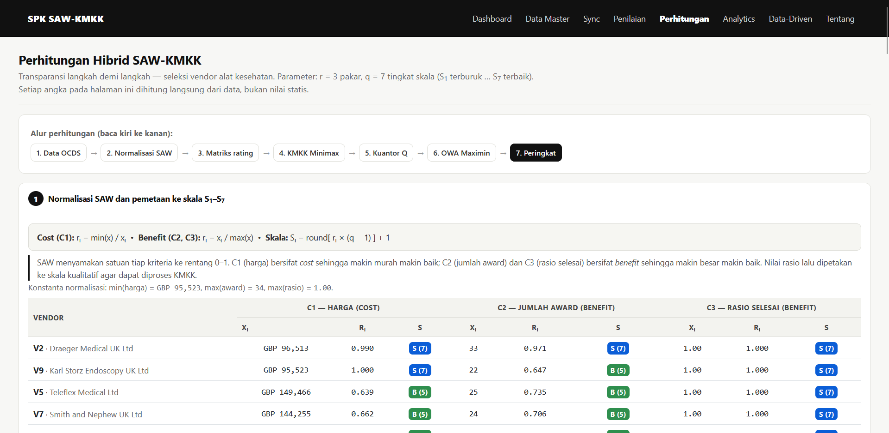

### Analytics

Menampilkan tren volume kontrak per tahun, distribusi nilai, dan statistik vendor.

  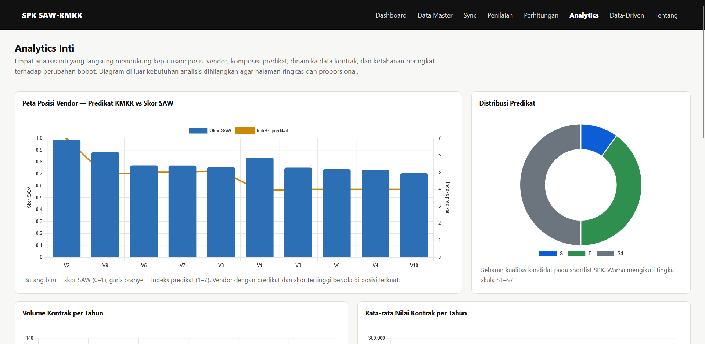

### Data-Driven (KNN)

Menampilkan klasifikasi vendor (Unggulan, Layak, Berisiko) beserta akurasi validasi LOO-CV.

  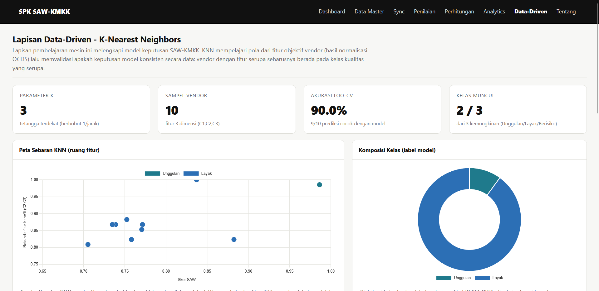

### Tentang

Menampilkan informasi ringkas mengenai sistem, metode, dan sumber data.

  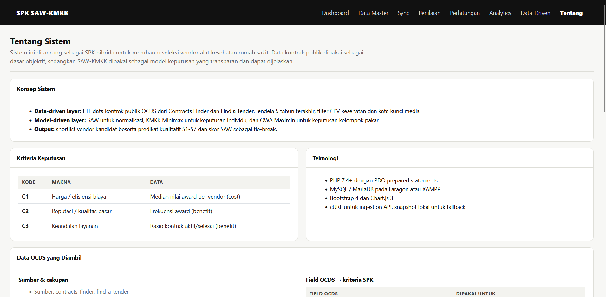

\---

## Skema Basis Data

Diagram relasi antar tabel ditunjukkan pada gambar berikut.

<details>
  <summary>Entity Relationship Diagram</summary>

  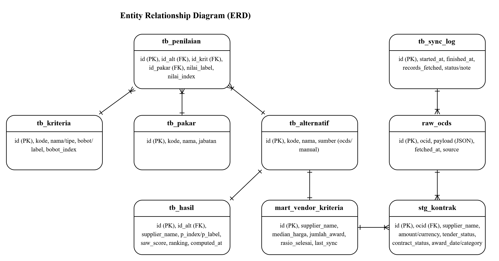
</details>

Daftar tabel dan fungsinya:

| Tabel                    | Fungsi                                                                |
| ------------------------ | --------------------------------------------------------------------- |
| `tb\_skala`              | Skala linguistik S1..S7 (kode dan label)                              |
| `tb\_kriteria`           | Kriteria C1 sampai C3 (tipe cost/benefit dan bobot)                   |
| `tb\_pakar`              | Daftar pakar atau penilai                                             |
| `tb\_alternatif`         | Vendor kandidat                                                       |
| `tb\_penilaian`          | Matriks nilai (alternatif x kriteria x pakar)                         |
| `raw\_ocds`              | Payload mentah OCDS (JSON)                                            |
| `stg\_kontrak`           | Kontrak hasil transformasi (supplier, amount, status, dan lainnya)    |
| `mart\_vendor\_kriteria` | Metrik agregat per vendor (median harga, jumlah award, rasio selesai) |
| `tb\_sync\_log`          | Riwayat dan audit sinkronisasi                                        |
| `tb\_hasil`              | Peringkat akhir (predikat KMKK-OWA dan skor SAW)                      |

\---

## Kriteria dan Skala Penilaian

### Kriteria (diturunkan otomatis dari data OCDS)

| Kode | Kriteria                        | Field OCDS                  | Tipe                          | Bobot  |
| ---- | ------------------------------- | --------------------------- | ----------------------------- | ------ |
| C1   | Median harga kontrak            | `awards.value.amount`       | Cost (makin kecil makin baik) | S7 (7) |
| C2   | Jumlah award (frekuensi menang) | jumlah `awards`             | Benefit                       | S6 (6) |
| C3   | Rasio kontrak selesai           | status `contracts` complete | Benefit                       | S5 (5) |

Kriteria bukan input bebas. Sistem hanya menggunakan field yang tersedia dan terukur pada data OCDS, sesuai pendekatan data-driven.

### Skala Linguistik 7 Tingkat (q = 7)

| Index | Kode | Makna         |
| ----- | ---- | ------------- |
| S1    | BS   | Buruk Sekali  |
| S2    | SK   | Sangat Kurang |
| S3    | K    | Kurang        |
| S4    | Sd   | Sedang        |
| S5    | B    | Baik          |
| S6    | SB   | Sangat Baik   |
| S7    | S    | Sempurna      |

\---

## Detail Algoritma

### 1\. Normalisasi SAW

```text
Benefit : r = nilai / nilai\_maks
Cost    : r = nilai\_min / nilai
Mapping : skala = round( r \* (q-1) ) + 1     // menjadi S1..S7
```

### 2\. Negasi Skala (Yager)

```text
Neg(Si) = S(q - i + 1)
```

Negasi membalik tingkat kepentingan, sehingga bobot besar menjadi kendala kecil.

### 3\. Agregasi Individu - Minimax (per pakar)

```text
P(i) = min over j \[ Neg(Wj)  v  Rij ]        // v = max
```

Mengambil performa pada kriteria terlemah sebagai prinsip kehati-hatian.

### 4\. Agregasi Kelompok - OWA (antar pakar)

```text
P = max over j \[ Q(j)  ^  Bj ]               // ^ = min ; Bj terurut menurun
b(k) = round\[ 1 + k(q-1)/r ]                 // kuantor "most" ; r=3, q=7 menghasilkan Q=\[3,5,7]
```

### 5\. Validasi KNN (data-driven)

```text
Jarak     : Euclidean pada ruang (C1, C2, C3) ternormalisasi
Kelas     : Unggulan (skor tinggi) / Layak / Berisiko
Validasi  : Leave-One-Out Cross-Validation (LOO-CV)
Parameter : k = 3 tetangga terdekat
```

LOO-CV menguji tiap vendor satu per satu sebagai data uji, sementara sisanya menjadi data latih. Akurasi dihitung dari proporsi prediksi yang benar. Metode ini sesuai untuk dataset kecil karena memanfaatkan seluruh data secara maksimal. Nilai k = 3 berarti kelas sebuah vendor ditentukan oleh suara mayoritas dari tiga tetangga terdekatnya, dan dipilih ganjil agar tidak terjadi seri.

\---

## Mengembangkan ke Studi Kasus Lain

Sistem dirancang modular sehingga dapat disesuaikan untuk domain lain, misalnya pemilihan vendor TI, konstruksi, katering, atau pengadaan di negara lain. Penyesuaian dilakukan pada beberapa titik berikut.

### 1\. Mengganti domain atau kategori data

- Ubah `ocds.cpv\_prefixes` pada `config.php`, misalnya `\['72']` untuk jasa TI atau `\['45']` untuk konstruksi.
- Sesuaikan daftar `health\_keywords` menjadi kata kunci domain yang baru.

### 2\. Mengganti sumber data

- Sistem ini memakai OCDS UK. Untuk portal lain yang juga berstandar OCDS, cukup ubah `ocds.endpoint` atau `cf\_endpoint` dan nilai `currency`.
- Untuk sumber non-OCDS (misalnya CSV, Excel, atau API lain), tulis ulang `ingestion/fetch\_ocds.php` dan `transform.php` agar menghasilkan tabel `stg\_kontrak` dengan kolom yang sama (`supplier\_name`, `amount`, `award\_date`, `contract\_status`, dan seterusnya). Lapisan berikutnya tidak perlu diubah.

### 3\. Mengubah kriteria penilaian

- Sesuaikan pemetaan pada `ingestion/aggregate.php` (definisi `mart\_vendor\_kriteria`).
- Daftarkan kriteria baru pada tabel `tb\_kriteria` (kode, nama, tipe cost/benefit, dan bobot).
- Tambah atau kurangi kolom mart sesuai metrik yang ingin digunakan.

### 4\. Mengubah bobot dan skala

- Bobot: ubah `bobot` pada `config.php`, atau aktifkan pembobotan objektif melalui `helpers/entropy.php`.
- Skala: ubah nilai `q`, misalnya `q=5` untuk skala lima tingkat. File `helpers/skala.php`, `saw.php`, dan `kmkk.php` akan mengikuti nilai `q` secara otomatis.

### 5\. Menyesuaikan klasifikasi KNN

- Ubah ambang kelas dan nilai k pada `helpers/knn.php` (fungsi `knnKelas` dan `knnPredict`).

Karena arsitekturnya berlapis, penggantian sumber atau kriteria tidak merusak metode inti, selama tabel `stg\_kontrak` dan `mart\_vendor\_kriteria` tetap konsisten.

\---

## Troubleshooting

| Masalah                                          | Penyebab                                                         | Solusi                                                                                                                                                          |
| ------------------------------------------------ | ---------------------------------------------------------------- | --------------------------------------------------------------------------------------------------------------------------------------------------------------- |
| Maximum execution time exceeded saat Sync        | Fetch live melebihi batas waktu PHP web                          | Jalankan `php ingestion/cron\_sync.php` melalui CLI, turunkan `max\_pages`, setel `max\_seconds` di bawah 120, atau naikkan `max\_execution\_time` pada php.ini |
| Data tidak berubah setelah mengubah `top\_n`     | Hasil dihitung saat sinkronisasi, bukan saat memuat halaman      | Jalankan sinkronisasi ulang atau putar ulang snapshot                                                                                                           |
| Tampil data lama saat snapshot aktif             | `use\_fallback=true` memuat snapshot                             | Setel `use\_fallback=false` untuk live, lalu sinkronkan                                                                                                         |
| Mayoritas vendor berpredikat rendah (BS atau SK) | Outlier dominan disertai normalisasi nilai/maks dan operator Min | Gunakan normalisasi yang tahan outlier (log, persentil, atau winsorize), perbaiki `award\_date`, dan naikkan `top\_n`                                           |
| Koneksi basis data gagal                         | Kredensial tidak sesuai                                          | Sesuaikan `config/config.php`                                                                                                                                   |

\---

## Keterbatasan dan Rencana Pengembangan

Keterbatasan saat ini:

- Normalisasi nilai/maks sensitif terhadap outlier karena distribusi nilai pengadaan cenderung berekor panjang.
- Kriteria terbatas pada tiga metrik yang tersedia di OCDS.
- KNN digunakan sebagai validator untuk sampel kecil, bukan sebagai prediktor berskala besar.

Rencana pengembangan:

- Normalisasi yang lebih tahan outlier (log-scaling, persentil, atau winsorize).
- Penambahan kriteria seperti ketepatan waktu, garansi, atau lokasi bila datanya tersedia.
- Pembobotan objektif penuh melalui metode Entropy atau CRITIC.
- Penjadwalan sinkronisasi otomatis menggunakan cron.
- Dukungan multi-negara dan multi-mata uang beserta konversi kurs.
- Ekspor laporan (PDF atau Excel) dan penyediaan API publik.

\---

## Tim

<a href="https://github.com/rizqidimas"></a> <a href="https://github.com/Adriseven"></a> <a href="https://github.com/mhmmdnrfhreza-code"></a>

\---

## Lisensi Data dan Atribusi

Data pengadaan bersumber dari layanan publik Pemerintah Britania Raya melalui OCDS API.

> Contains public sector information licensed under the Open Government Licence v3.0.
> Sumber data: Find a Tender Service dan Contracts Finder (GOV.UK), OCDS API.

Detail selengkapnya terdapat pada berkas `LICENSE-DATA.txt`.

\---

## Kredit

- Metode KMKK linguistik: Yager, R. R. (1993).
- Standar data: Open Contracting Data Standard (OCDS) v1.1.
- Dikembangkan sebagai proyek simulasi penelitian atau mini-skripsi Sistem Pendukung Keputusan.

\---

## Lisensi

MIT.